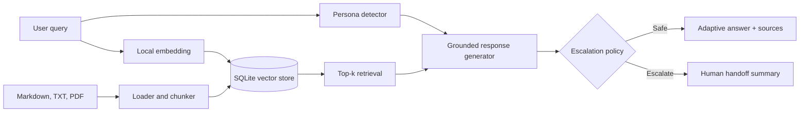

# Northstar Persona-Adaptive Support Agent

An end-to-end customer-support agent that detects a user's communication persona, retrieves verified product guidance, changes its answer style, and creates a structured human handoff when automation is unsafe or insufficient.

The included fictional SaaS knowledge base contains 12 realistic documents, including a multi-page PDF. The application runs as a command-line chatbot or Streamlit interface.

## Features

- Classifies **Technical Expert**, **Frustrated User**, and **Business Executive** personas
- Chunks Markdown, text, and PDF files while preserving source, section, and page metadata
- Generates local feature-hashing embeddings and stores them in a persistent SQLite vector database
- Retrieves top-k chunks with cosine similarity and displays citations and confidence scores
- Generates persona-adaptive, retrieval-grounded answers
- Supports OpenAI, Google Gemini, and Ollama models plus an offline extractive mode
- Escalates low-confidence, sensitive, and repeatedly unresolved conversations
- Produces a JSON-ready human handoff with conversation history, sources, attempted actions, and next steps
- Includes multi-turn memory, tests, configurable thresholds, and CI

## Architecture



The workflow remains intentionally explicit rather than hiding routing inside a large agent framework. Each decision can be tested, logged, and explained during the demo.

## Tech stack

| Component | Choice |
|---|---|
| Runtime | Python 3.11+ |
| Interface | Streamlit 1.36+ and CLI |
| Document ingestion | pypdf 4.2+ and native Markdown/TXT loading |
| Embeddings | Deterministic 768-dimensional feature hashing |
| Vector database | SQLite with persisted vectors and metadata |
| Similarity | Cosine similarity |
| LLM providers | Google Gemini API, OpenAI Responses API, or local Ollama |
| Offline fallback | Retrieval-only grounded template generator |
| Tests | pytest 8.2+ |

## Quick start

```bash
python -m venv .venv
# Windows: .venv\Scripts\activate
# macOS/Linux: source .venv/bin/activate
pip install -e ".[dev]"
copy .env.example .env     # Windows
# cp .env.example .env    # macOS/Linux
python -m support_agent.cli --ingest
streamlit run src/support_agent/ui.py
```

Open the address printed by Streamlit, usually `http://localhost:8501`.

For the dependency-light CLI:

```bash
python -m support_agent.cli
```

The first question automatically indexes the documents if `--ingest` was not run.

## LLM configuration

The default `template` mode is fully local. It is an extractive safety fallback intended to prove retrieval, citations, routing, and escalation without an API key. For the assignment demo, configure an actual LLM.

### Google Gemini

```env
LLM_PROVIDER=gemini
GEMINI_API_KEY=your_key_here
GEMINI_MODEL=gemini-2.5-flash
```

Then install the provider extra:

```bash
pip install -e ".[gemini]"
```

### OpenAI

```env
LLM_PROVIDER=openai
OPENAI_API_KEY=your_key_here
OPENAI_MODEL=gpt-4o-mini
```

Then install the provider extra:

```bash
pip install -e ".[openai]"
```

### Ollama

Install Ollama, download the configured model, and set:

```env
LLM_PROVIDER=ollama
OLLAMA_MODEL=llama3.2
OLLAMA_BASE_URL=http://localhost:11434
```

No API key is required. Both LLM providers receive the same strict prompt: answer only from supplied context, acknowledge insufficient evidence, never invent an ETA, and use inline source markers.

## Persona detection strategy

`PersonaDetector` is a transparent weighted classifier. It scores technical terminology, emotional or urgent language, and business-impact phrasing. Extra signals include HTTP status codes, command-line syntax, repeated punctuation, uppercase text, and short outcome-focused questions.

The highest score determines the persona. A neutral message defaults to Business Executive because its concise style is the safest low-assumption response. The UI displays both the label and confidence.

This rule-based method is fast, deterministic, testable, and easy to explain. A production extension could use a small supervised classifier and retain the rules as high-precision overrides.

## RAG pipeline design

1. `documents.py` recursively loads `.md`, `.txt`, and `.pdf` files.
2. Markdown headings define section metadata; PDF pages retain page numbers.
3. Text is divided into 850-character chunks with 120-character overlap.
4. `LocalHashEmbedding` tokenizes terms and bigrams into normalized 768-dimensional vectors.
5. `SQLiteVectorStore` persists text, vectors, source file, section, and page.
6. The query is embedded with the same function and ranked by cosine similarity.
7. The top four chunks are sent to the generator and shown in the interface.

Feature hashing is deliberately offline and reproducible. Its trade-off is weaker semantic matching than transformer embeddings. The vector store interface can be replaced by OpenAI embeddings plus pgvector, Chroma, or Qdrant without changing the agent workflow.

## Adaptive response policy

| Persona | Response behavior |
|---|---|
| Technical Expert | Detailed diagnostics, precise terms, numbered steps, configuration and error context |
| Frustrated User | Brief empathy, plain language, reassurance, short action sequence |
| Business Executive | Concise outcome, operational impact, documented resolution guidance, minimal jargon |

The generator receives retrieved text only. LLM prompts forbid unsupported claims and invented resolution estimates. The offline mode directly composes retrieved passages, making hallucination structurally unlikely.

## Escalation logic

Escalation is configurable through environment variables and occurs when:

- no knowledge chunks are returned;
- the best retrieval score is below `RETRIEVAL_THRESHOLD`;
- billing, refund, legal, privacy, security, ownership, or other account-sensitive language appears;
- dissatisfaction appears across at least `DISSATISFACTION_TURNS` interactions.

An escalated response includes:

- detected persona;
- current issue;
- conversation history;
- retrieved documents;
- previously suggested actions;
- escalation reasons;
- recommended human next step.

Rules live in `src/support_agent/escalation.py`, separate from generation, so a model cannot decide to bypass mandatory escalation.

## Configuration

| Variable | Default | Purpose |
|---|---:|---|
| `LLM_PROVIDER` | `template` | `template`, `openai`, or `ollama` |
| `TOP_K` | `4` | Retrieved chunks per query |
| `RETRIEVAL_THRESHOLD` | `0.08` | Minimum best-match score |
| `DISSATISFACTION_TURNS` | `2` | Complaining turns before handoff |
| `CHUNK_SIZE` | `850` | Maximum chunk characters |
| `CHUNK_OVERLAP` | `120` | Overlap between chunks |
| `INDEX_PATH` | `.support_index.sqlite3` | Persistent vector DB path |

Never commit `.env`, API keys, tokens, private customer content, or generated production indices.

## Example queries

1. Technical: `Our API returns 401 invalid_token in production but works in sandbox. What should I log and verify?`
2. Technical: `Webhook HMAC verification fails after JSON parsing. Explain the root cause.`
3. Frustrated: `I've tried resetting my password again and again and nothing works!!!`
4. Executive: `What is the operational impact of the incident, and when will it be resolved?`
5. Executive: `Summarize the risk and next step for slow API requests.`
6. Escalation: `I was charged twice and need an immediate refund.`
7. Escalation: `I think an API key was exposed and customer data may be at risk.`

## Tests

```bash
pytest -q
ruff check src tests
```

Tests cover all personas, relevant retrieval, low-confidence escalation, sensitive escalation, repeat dissatisfaction, and an end-to-end grounded answer.

## Demo recording outline (3-8 minutes)

1. Show `src`, `data`, `tests`, `.env.example`, and this README.
2. Run `python -m support_agent.cli --ingest` and explain chunk metadata.
3. Open Streamlit and ask examples for all three personas.
4. Expand retrieved sources and point out scores and PDF page citations.
5. Ask at least five queries, including API auth and webhook signatures.
6. Trigger a refund or security case and expand the handoff JSON.
7. Explain why mandatory escalation is deterministic and separate from the LLM.
8. Briefly mention limitations and future improvements.

## Known limitations and improvements

- Feature-hashing embeddings match vocabulary well but capture fewer semantic relationships than transformer embeddings.
- Persona rules may misclassify mixed-tone messages; a labeled evaluation set would support calibration.
- SQLite uses a linear similarity scan and is intended for a small knowledge base, not millions of chunks.
- Conversation memory is process-local and should move to encrypted persistent storage for production.
- OpenAI and Ollama integrations need provider-level retry, timeout, and observability policies for production traffic.
- Retrieval evaluation should add golden queries, precision@k, citation faithfulness, and escalation recall.
- A production system should add authentication, redaction, audit logging, human approval, and analytics.

## Repository layout

```text
data/                       12 support documents, including PDF
scripts/build_policy_pdf.py reproducible PDF generator
src/support_agent/
  agent.py                  workflow orchestration
  persona.py                persona classifier
  documents.py              loaders and chunker
  vector_store.py           embeddings and persistent retrieval
  generation.py             grounded OpenAI/Ollama/template generation
  escalation.py             mandatory escalation and handoff
  cli.py                    command-line application
  ui.py                     Streamlit chat application
tests/                      unit and end-to-end tests
```

## Integrity

Responses are generated at runtime from retrieved documents. No user answers or demonstrations are pre-generated, and no API keys are committed. The fictional product and documentation exist solely to provide a coherent, original assignment domain.
